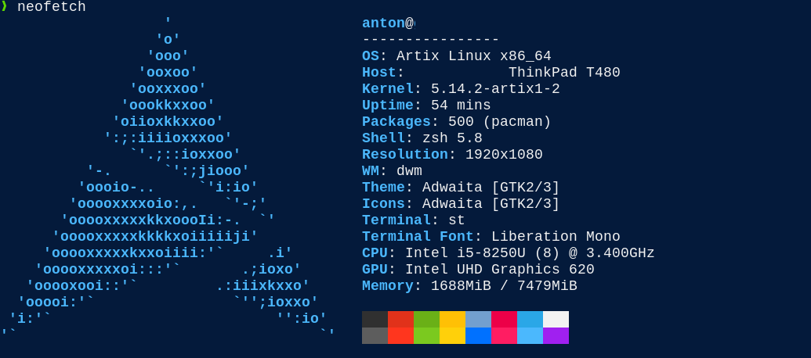

# ST_GOGH

## Gogh colour scheme for st 

Themes from https://mayccoll.github.io/Gogh/ for st (https://st.suckless.org/)

## Dependencies

- curl
- jq
- python

st must be installed (`find $HOME -path '**/st/config.h'` is used to find it)

## Usage

### Install

```sh
git clone https://github.com/co-anton/st_gogh.git
cd st_gogh
chmod +x replace.py find_name.py st_gogh
```

### Usage

```sh
./st_gogh 
# Choose theme betweem "1" (3024Day) and "220" (Zenburn)
# Recompile st and enjoy! 
```

or

```sh
./st_gogh 3024Day
# Recompile st and enjoy!
```

## Example with Elio theme


## Remarks on what it does

- Themes are stored locally in `$HOME/.config/terminal_colours/colours.json`
- Relies on /tmp/ for intermediary files 
- A backup of config.h is created but it's always good to make another copy just in case :) 

## Improvement

- [ ] Use shell scripting for the replace part as well rather than python
- [ ] Make it POSIX compliant, currently uses `zsh` 
